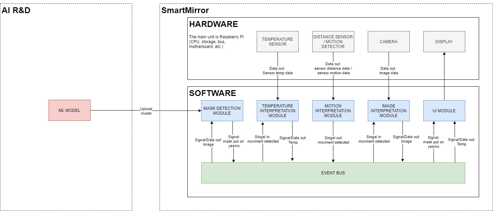

# ai-smart-mirror
Repository contains all the code necessary to run working solution for smart mirror.

# Architecture

# Modules
## Camera module
WIP
## Distance sensor module
WIP

# Test environment
Configuration and usage of test environment can be found in [test environment documentation](doc/test_environment.md).
